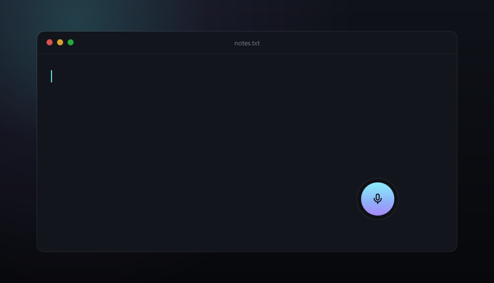
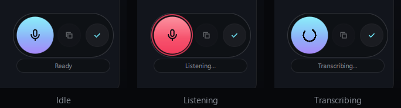

# drawl

Offline voice dictation for Windows. A floating pill that stays on top: press
the hotkey (or click the orb), speak, and the text lands in whichever window you
were typing in. No audio ever leaves your computer.

<p align="center">
  
</p>

<p align="center">
  <sub>The real interface. The halo follows the actual energy of the voice and
  the text is what the model genuinely produced for that audio; the microphone is
  replaced by a file, so the recording does not depend on background noise.
  The spoken sentence is Italian, to show a language other than English.</sub>
</p>

## Download

[**Latest release**](https://github.com/gportente/drawl/releases/latest) —
installer (49 MB) or portable archive (75 MB). On first launch it downloads the
recognition model, ~490 MB: an internet connection is needed only for that step.

To work from source, see *Installing* below.

## How it is built

| Piece | Choice | Why |
|---|---|---|
| Recognition | [Parakeet TDT 0.6B v3](https://github.com/k2-fsa/sherpa-onnx) via sherpa-onnx | ~13× realtime on CPU, 25 European languages including English and Italian |
| Fallback | faster-whisper (`large-v3-turbo`) | covers languages outside Parakeet's 25 |
| Interface | PySide6 + QML (Qt Quick) | GPU-accelerated animation, frameless translucent window |
| Output | Clipboard + synthetic Ctrl+V | works in any application, with no integration |

Inference runs entirely in native code (ONNX Runtime / CTranslate2): Python only
orchestrates, and does not show up in the timings.

## Installing

```powershell
python -m venv .venv
.venv\Scripts\python.exe -m pip install -r requirements.txt
```

The Parakeet model (~490 MB compressed) downloads itself on first launch into
`%LOCALAPPDATA%\drawl\models`, with progress shown under the pill.

## Using it

```powershell
.venv\Scripts\pythonw.exe -m drawl     # no console window
```

### Desktop shortcut

```powershell
.venv\Scripts\python.exe tools\make_icon.py   # generates drawl\ui\drawl.ico

$root = (Get-Location).Path
$ws = New-Object -ComObject WScript.Shell
$s = $ws.CreateShortcut((Join-Path ([Environment]::GetFolderPath("Desktop")) "drawl.lnk"))
$s.TargetPath = "$root\.venv\Scripts\pythonw.exe"
$s.Arguments = "-m drawl"
$s.WorkingDirectory = $root
$s.IconLocation = "$root\drawl\ui\drawl.ico,0"
$s.Save()
```

The target is `pythonw.exe` rather than `python.exe`: being the GUI-subsystem
build of Python, it opens no console window.

### Starting with Windows

Copy the same shortcut into the Startup folder:

```powershell
Copy-Item (Join-Path ([Environment]::GetFolderPath("Desktop")) "drawl.lnk") `
          ([Environment]::GetFolderPath("Startup"))
```

Turn it off from *Task Manager → Startup apps*, or by deleting that `.lnk`.
Idle, drawl takes ~125 MB, because the model does not stay in memory: see
*Resource use*. A second copy started by mistake notices the first and exits,
rather than sitting there without a hotkey.

<p align="center">
  
</p>

- **Ctrl+Shift+Space** — start and stop dictation, from any application
- **Click the orb** — the same thing
- **Drag the orb** — move the pill; the position is remembered
- **Hover** — reveals the two secondary buttons and the status bar
- **Tray icon** — show/hide, dictate, quit

The two secondary buttons are, for now, *copy the last transcription* and
*toggle auto-paste* (with paste off the text only goes to the clipboard). They
are the two slots kept for future features.

## Settings

`%LOCALAPPDATA%\drawl\config.json`, created on first launch:

| Key | Default | Notes |
|---|---|---|
| `engine` | `parakeet` | or `whisper` |
| `ui_language` | `en` | `en`, `it`, or `auto` to follow the system |
| `hotkey` | `ctrl+shift+space` | `ctrl+alt+space` is often already taken on Windows |
| `auto_paste` | `true` | if `false`, the text only reaches the clipboard |
| `input_device` | `null` | microphone index or name; `null` is the system default |
| `num_threads` | `10` | inference threads |
| `unload_after_s` | `180` | seconds idle before freeing the RAM; `0` never does |
| `whisper_model` | `large-v3-turbo` | only used with `engine: whisper` |
| `language` | `it` | Whisper only; Parakeet detects the language itself |

### Interface language

English by default, Italian available. Set `ui_language` to `it`, or to `auto`
to follow the system locale, and restart. Adding a third language means adding a
column to `drawl/i18n.py`: no build step, no compiled catalogues.

Recognition is a separate matter and needs no setting — Parakeet detects the
spoken language on its own, across 25 European languages.

## Measured performance

On an AMD Ryzen AI 9 365 (10 cores / 20 threads), CPU only, on a 17.8 s
Italian sentence:

| Model | Load | Transcribe | Speed |
|---|---|---|---|
| **Parakeet v3 int8** | **2.1 s** | **1.4 s** | **13×** realtime |
| whisper large-v3-turbo int8 | 23.2 s | 5.4–6.5 s | 2.7× |
| whisper small int8 | 9.4 s | 2.4 s | 7.4× |
| whisper base int8 | 3.3 s | 0.9 s | 20× |

While loaded, Parakeet takes ~730 MB, nearly all of it model weights (the int8
encoder alone is 652 MB). On a machine short of memory, `engine: whisper` with
`whisper_model: base` stays under 250 MB, at the cost of a few more errors.

### Resource use

| Phase | RAM | CPU |
|---|---|---|
| idle, model unloaded | **125 MB** | 0.02 % |
| recording, microphone open | 802 MB | 4 % of one core |
| short dictation (8 s) | 854 MB | 9.5 cores for 0.5 s |
| long dictation (60 s) | 1.23 GB | 9.9 cores for 3.2 s |
| after `unload_after_s` idle | **157 MB** | 0.02 % |

Startup: 2 s from launch to "Ready". On disk: 640 MB the model, 963 MB the
Python environment, 89 KB the code.

**The model does not stay in memory.** It takes ~730 MB, so after
`unload_after_s` seconds idle it is dropped, and reloaded when the next
recording starts — in parallel, while you are already speaking. Loading costs
~2.8 s, less than an ordinary dictation takes, so the extra wait at the end of a
sentence is:

| Sentence length | Extra wait |
|---|---|
| 8 s | 0.00 s |
| 3 s | 0.33 s |
| 1.5 s | 1.30 s |

Only very short dictations pay part of it, and only the first one after a break.
With `unload_after_s: 0` the model stays loaded for good (825 MB, constantly).

### Long audio

Parakeet processes the whole clip at once, so time and memory grow faster than
linearly with duration, and past **400 seconds** (5000 encoder frames) it fails
with a broadcast error in the self-attention. Audio is therefore split into
~45 s chunks cut on silences (`drawl/audio/segment.py`).

| Duration | Without chunking | With chunking |
|---|---|---|
| 15 s | 0.91 s · 875 MB | 0.76 s · 874 MB |
| 60 s | 4.31 s · 1.4 GB | 3.15 s · 1.3 GB |
| 120 s | 9.24 s · 2.0 GB | 6.84 s · 1.4 GB |
| 300 s | 35.66 s · 3.6 GB | 20.50 s · 1.6 GB |
| 440 s | error | 30.05 s · 1.7 GB |
| 637 s | error | 42.74 s · 1.7 GB |

Chunked, the realtime factor stays flat at around **15×** at any duration,
memory settles below 1.7 GB, and the six-minute-forty ceiling disappears.

## Layout

```
drawl/
  i18n.py              user-facing strings, English and Italian
  audio/recorder.py    microphone capture at 16 kHz + RMS level
  audio/segment.py     splitting long audio on silences
  engine/base.py       engine lifecycle: prepare / load / unload
  engine/parakeet.py   sherpa-onnx engine (the default)
  engine/whisper.py    faster-whisper engine (fallback)
  engine/models.py     downloading and unpacking the models
  output/inject.py     synthetic Ctrl+V into the active window
  output/hotkey.py     global hotkey (RegisterHotKey on its own thread)
  output/single_instance.py  stops a second copy running without a hotkey
  ui/Main.qml          the pill: orb, buttons, status bar
  ui/controller.py     QML <-> engines bridge, states and model memory
tests/test_pipeline.py end-to-end WAV -> text
tests/test_segment.py  long-audio chunking
tests/test_paste.py    the synthetic Ctrl+V
tools/make_icon.py     generates drawl.ico for the shortcuts
tools/make_demo.py     generates the README images in docs/
tools/build.ps1        produces the installer and the portable archive
```

## Checking it works

```powershell
.venv\Scripts\python.exe tests\test_pipeline.py some_audio.wav
.venv\Scripts\python.exe tests\test_segment.py
.venv\Scripts\python.exe tests\test_paste.py
```

The first loads the application's real engine, transcribes the file and checks
that the microphone opens at the configured rate.

## Implementation notes

Five behaviours worth remembering, all commented in the code:

- With the flags `Qt.Tool | Qt.WindowDoesNotAcceptFocus` a `HoverHandler` never
  receives hover events: a `MouseArea` is needed instead.
- `Repeater` cannot instantiate `ShapePath`, because it is not an `Item`.
- The `INPUT` struct for `SendInput` must include `MOUSEINPUT` too: without it,
  on x64 it is 32 bytes instead of 40 and the call fails with error 87.
- A `Slot`'s return type towards QML must be declared with the class
  (`result=QPointF`), not the string `"QPoint"`: otherwise the conversion fails
  silently and the handler that called it stops, with no visible error.
- Two windows that are both "always on top" have no guaranteed order between
  them: whichever must stay above needs an explicit `raise_()`.

**Dragging.** The pill does not use `startSystemMove()`; it moves itself, asking
the operating system where the pointer is on every event. Windows' own drag
honours the *"show window contents while dragging"* setting
(`HKCU\Control Panel\Desktop\DragFullWindows`), which is off whenever visual
effects are tuned for performance — and then all you would see is a dashed
rectangle moving. Moving the window directly keeps it smooth however the system
is configured.

The coordinates used are absolute rather than incremental: moving a window is
asynchronous, so summing relative deltas would leave the pill trailing behind
the pointer.

**Screenshots.** `tools/make_demo.py` keeps a frame only if it contains a marker
the scene paints in its own corner. Without that check the first frame can
portray whatever window sits underneath — which is exactly how a private
document once ended up in a published recording.

## To do

- Voice skills ("open Claude Code"): needs fuzzy matching, because English
  proper nouns get mangled ("Claude Code" → *load code*, *Clod Code*) while
  plain Italian is transcribed correctly
- A local wake word with openWakeWord — detected on the audio, not in the
  transcript: "hey drawl" comes out as *Hey Drawl*, *Hey Droll*, *Ey Droll*
- Push-to-talk: `RegisterHotKey` reports the press, never the release
- NPU acceleration on XDNA2 through the Ryzen AI software
- Code signing, to stop the SmartScreen warning on first launch

## Licence

MIT — see [LICENSE](LICENSE).
